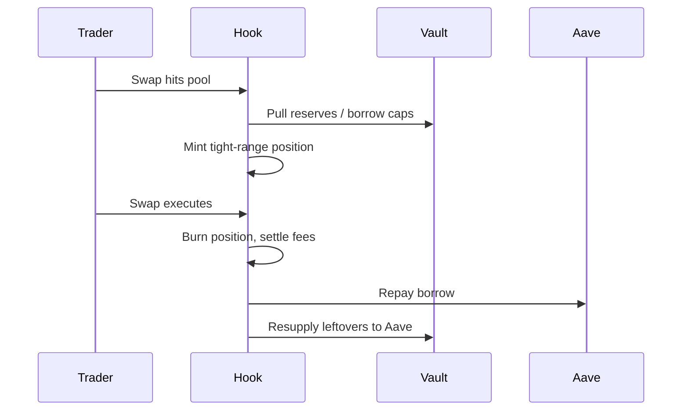

# JIT Liquidity Boost Vault

[](#tests--coverage)
[](#license)
[](#architecture--components)

## Description
JIT Liquidity Boost Vault combines Uniswap v4 hooks with an ERC4626 vault that supplies to Aave. The hook injects tight-range liquidity right before swaps on ETH-LST pairs (wstETH/ETH, rETH/ETH, weETH/ETH, WETH/ETH), then removes it immediately after, capturing fees while deposits earn Aave yield.

## Problem Statement
LST/ETH pools often face shallow liquidity exactly when swaps arrive, causing price impact and missed fee revenue. LPs also sit idle between swaps, leaving capital underutilized.

## Solution & Financial Impact
- **JIT depth on demand:** Liquidity only when swaps occur → lower slippage, better execution.
- **Leverage with safety:** Borrow up to 2x vault reserves from Aave for temporary depth; repay post-swap.
- **Continuous yield:** Idle assets stay on Aave; capital works between swaps.
- **Financial impact:** Higher fee capture per unit of liquidity, improved capital efficiency for LPs, lower slippage for traders; vault APR = Aave supply yield + JIT swap fees.

## Diagrams / Flows
```mermaid
flowchart LR
  U[User deposit] --> V[Vault supplies to Aave]
  S[Swap arrives] --> B{Hook beforeSwap}
  B --> L[Add JIT liquidity (vault + optional borrow)]
  L --> X[Swap executes]
  X --> A{Hook afterSwap}
  A --> R[Remove liquidity, collect fees]
  R --> P[Repay borrow + resupply to Aave]
  P --> V
```



## Architecture & Components
- **JitLiquidityVault (`src/JitLiquidityVault.sol`)**: ERC4626 vault; Aave supply/borrow; Chainlink pricing; owns pool funds.
- **JitLiquidityHook (`src/JitLiquidityHook.sol`)**: Uniswap v4 hook implementing `beforeSwap`/`afterSwap`; caps JIT size; adds/removes liquidity; owns the vault.
- **Mocks & test utils**: Under `test/Mocks` and `test/utils` for unit, integration, and invariant suites.
- **Supported assets**: WETH, wstETH, rETH, weETH (mainnet addresses baked into vault/hook).

## Tests & Coverage
- **Total tests:** 69 (unit + integration + invariants).
- **Coverage goal:** 100% on core suites (use `--ir-minimum --skip E2ETest` to avoid stack-depth issues in the E2E script).
```bash
forge test
forge test -vvv
forge coverage --ir-minimum --skip E2ETest
forge test --match-path 'test/JitLiquidityIntegration.t.sol'
```

## Installation & Setup
```bash
curl -L https://foundry.paradigm.xyz | bash
foundryup
forge install
forge build
```

## Run Tests & Scripts
```bash
# All tests
forge test

# Integration only
forge test --match-path 'test/JitLiquidityIntegration.t.sol'

# Coverage (core suites)
forge coverage --ir-minimum --skip E2ETest
```

## End-to-End Demo (fork)
```bash
source .env
anvil --fork-url "$ETH_RPC_URL" --code-size-limit 40000

export PRIVATE_KEY=0xac0974bec39a17e36ba4a6b4d238ff944bacb478cbed5efcae784d7bf4f2ff80
export ETH_FROM=0xf39fd6e51aad88f6f4ce6ab8827279cfffb92266

forge script script/E2ETest.s.sol:E2ETestScript \
  --rpc-url http://127.0.0.1:8545 \
  --sender "$ETH_FROM" \
  --private-key "$PRIVATE_KEY" \
  --broadcast --legacy -vv
```

**Recent fork example (wei):**
- Hook: `0xc39Baf2bB37D56b72E86ca7d7f6305Bb2A77C0C0`, Vault: `0x2Ae7d00D548c76c0078130C36881b8930B355A26`
- Swap: 10,000,000,000,000,000 rETH → 9,943,657,362,539,014 WETH
- Post-swap vault: WETH `49,501,321,095,158,524,861` wei, rETH `8,671,419,267,218,658` wei, HF high.

## Project Structure
```
.
├── src/                     # Hook + vault
├── test/                    # Unit, integration, invariants, mocks
├── script/                  # Deploy & E2E scripts
└── lib/                     # Dependencies
```

## Roadmap
- Expand supported pools beyond ETH-LST pairs.
- Add configurable leverage caps per pool.
- Formal verification and external audit.
- Strategy toggles for fee reinvest vs. distribution.

## Security Considerations
- Access: hook is vault owner; Aave interactions gated by owner.
- Oracles: Chainlink feeds are relied upon for accounting; mock in tests.
- Economic: JIT profitability depends on fee tiers vs. gas/borrow costs.
- Audits: Not yet audited—use in production at your own risk.

## License
MIT


